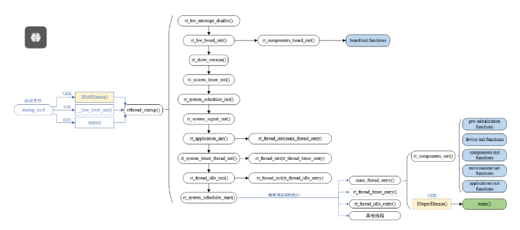
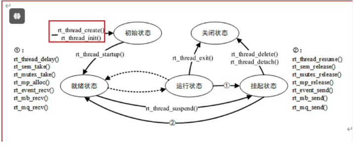
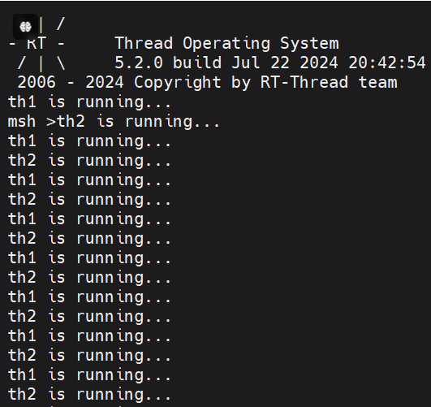

# *2024-RSOC 暑期夏令营*


<font face='宋体' color=#9400D3 size=6>DAY2 多线程的学习和分享</font>

今天上午主要学习了RT_Thread作为实时系统的特性、多线程的概念，以及RT_Thread的启动流程。下午主要是多线程的应用、嵌入式开发流程以及github的使用。


## RT—Thread实时操作系统

实时操作系统（Real-Time Operating System, RTOS）是一种为实时应用程序设计的操作系统。它的主要特性是能够在严格的时间约束下执行任务，保证任务在规定的时间内完成。

### 实时操作系统的特点

1. **确定性**：RTOS 提供严格的时间保证，确保系统能够在特定的时间内完成任务。任务的执行时间是可预测的。
2. **优先级调度**：RTOS 通常采用优先级调度算法，根据任务的优先级来分配 CPU 时间。高优先级的任务在时间紧迫时可以抢占低优先级的任务。
3. **多任务处理**：RTOS 支持多个任务同时运行，能够有效管理任务之间的竞争和资源共享。
4. **低延迟**：RTOS 设计上尽量减少系统调用和中断处理的延迟，以确保任务能够快速响应外部事件。
5. **资源管理**：RTOS 提供有效的内存和资源管理，确保系统在实时性和稳定性之间找到平衡。

### 实时操作系统的分类

1. **硬实时系统（Hard RTOS）**：对于这些系统，延迟和任务失效都有严格的限制，任务必须在规定时间内完成，否则可能会导致严重后果。例如，航空航天和医疗设备等领域。
2. **软实时系统（Soft RTOS）**：这些系统对任务的及时性要求较低，即使有些任务未能在规定时间内完成，系统依然可以继续正常运作。例如，视频流处理和音频处理等应用。

### 常见的实时操作系统

一些常见的实时操作系统包括：

- FreeRTOS
- VxWorks
- QNX
- RTEMS
- Micrium

这些 RTOS 被广泛应用于工业、汽车、医疗等多个领域，因为它们能够提供可靠的实时性能和响应能力。

***RT-Thread*** 是一个开源的实时操作系统，专门为嵌入式设备和物联网（IoT）应用程序设计。与其他实时操作系统相比，RT-Thread 具有以下几个显著特点：



### 1. **轻量级和模块化设计**

RT-Thread 的内核非常轻量，占用的内存空间小，适合在资源受限的环境中运行。此外，它采用模块化设计，用户可以根据需求选择性地添加或删除组件，以精简系统资源的使用。

### 2. **强大的开发工具**

RT-Thread 提供了一套完善的开发工具，包括 RT-Thread Studio，这是一个集成开发环境（IDE），支持图形化界面，便于用户进行应用开发和调试。它还支持多种编程语言、版本控制和调试功能，提升了开发效率。

### 3. **丰富的中间件支持**

RT-Thread 提供了众多的中间件和附加库，支持多种通信协议（如 MQTT、CoAP）以及文件系统等功能。这些中间件可以帮助开发者快速构建复杂的应用程序，而无需从头开始实现所有功能。

### 4. **灵活的调度机制**

RT-Thread 支持多种调度策略，包括优先级调度、时间片轮转等，能够根据应用需求灵活调整任务管理策略。这种灵活性使得 RT-Thread 能够适应不同性能要求的应用。

### 5. **易于入门和使用**

RT-Thread 设计为易于学习，具有清晰的文档和较好的社区支持。新手开发者能够快速上手，并利用丰富的示例代码进行学习。

### 6. **组件化的网络栈**

RT-Thread 有一个可选的网络协议栈，支持 TCP/IP、HTTP 等协议，适合物联网应用。其组件化设计使得开发者能够根据需要选择合适的网络库，减少资源的浪费。

### 7. **良好的社区支持**

RT-Thread 拥有活跃的开发者社区，提供丰富的文档、示例、教程和技术支持。这使得开发者在遇到问题时能够更容易找到解决方案。

### 8. **多架构支持**

RT-Thread 支持多种硬件架构，包括 ARM Cortex-M、RISC-V、MIPS 等，且对不同平台的适配性强。这为开发者在不同硬件平台上部署应用提供了便利。

### 总结

RT-Thread 作为一个嵌入式实时操作系统，其轻量级、模块化和灵活性使其在物联网和嵌入式应用中具有明显优势。它不仅具备实时性特性，还提供了丰富的开发支持和社区资源，适合从初学者到专业开发者在不同场景下使用。


## 多线程管理

RT-Thread 实时操作系统具有强大的多线程管理功能，适用于紧凑且响应快速的嵌入式环境。其多线程管理系统设计得简单且高效，主要特点如下：



### 1. **线程的创建和管理**

RT-Thread 允许用户创建多个线程（tasks），每个线程都有自己的执行上下文，包括栈、寄存器等。线程可通过以下方式进行管理：

- **创建和删除线程**：使用 API 函数可轻松创建和删除线程。
- **线程控制**：可以使用优先级、状态等来控制线程的行为。

### 2. **优先级调度**

RT-Thread 采用优先级调度机制，用户可以根据应用需求为每个线程分配不同的优先级。高优先级的线程会优先执行，在高负载情况下确保关键任务的实时性。支持的调度策略包括：

- **抢占式调度**：当高优先级线程变为就绪状态时，低优先级线程会被抢占，确保高优先级线程能立即执行。
- **时间片轮转**：在相同优先级的线程之间，RT-Thread 支持使用时间片轮转的方式进行调度。

### 3. **线程同步**

为了确保线程之间的安全交互，RT-Thread 提供了多种同步机制：

- **信号量**：用于管理对共享资源的访问，防止竞争条件。
- **互斥锁**：确保同一时间只允许一个线程访问某个共享资源，防止数据冲突。
- **事件标志组**：用于多线程之间的事件通知和同步，可以设置和清除标志，以实现线程间的通信。

### 4. **消息队列**

RT-Thread 提供消息队列机制，线程可以通过消息队列进行异步通信。消息队列可以存储多个消息，允许一个线程发送消息而另一个线程接收消息，适用于需要线程间数据传递的场景。

### 5. **延时和定时器**

线程可以通过延时 API 休眠一段时间，或者使用定时器进行周期性任务调度。这使得开发者能够方便地管理时间敏感的操作。

### 6. **线程状态管理**

RT-Thread 中的线程可以处于不同状态，包括就绪、运行、阻塞、挂起等。操作系统会根据当前系统负载和线程优先级动态调节线程状态，以优化 CPU 的使用效率。

### 7. **堆栈管理**

RT-Thread 为每个线程分配独立的堆栈，且用户可以自定义堆栈大小，以适应不同线程需求。堆栈溢出检测机制能提高系统的可靠性。


### 线程示例：

```c
 * Copyright (c) 2023, RT-Thread Development Team
 *
 \* SPDX-License-Identifier: Apache-2.0
 *
 \* Change Logs:
 \* Date      Author    Notes
 \* 2023-07-06   Supperthomas first version
 \* 2023-12-03   Meco Man   support nano version
 */\#include <board.h>
\#include <rtthread.h>
\#include <drv_gpio.h>
\#ifndef RT_USING_NANO
\#include <rtdevice.h>
\#include <rtdbg.h>
\#endif /* RT_USING_NANO */
rt_thread_t th1,th2 = RT_NULL;

void th1_entry(void){
  while (1)
  {
    rt_kprintf("th1 is running...\n");
    rt_thread_mdelay(500);
  }

}
void th2_entry(void){
  while (1)
  {
    rt_kprintf("th2 is running...\n");
    rt_thread_mdelay(500);
  }
}

int main(void)
{
  th1 = rt_thread_create("th1", th1_entry, RT_NULL, 1024, 20, 5);
  if(th1 == RT_NULL){
    LOG_E("thread th1 create failed...\n");
  }
  else{
    rt_thread_startup(th1);
    LOG_D("thread th1 create success!\n");
  }
  th2 = rt_thread_create("th2", th2_entry, RT_NULL, 1024, 21, 5);
  if(th2 == RT_NULL){
    LOG_E("thread th2 create failed...\n");
  }
  else{
    rt_thread_startup(th2);
    LOG_D("thread th2 create success!\n");
  }
}
```

### 运行结果

