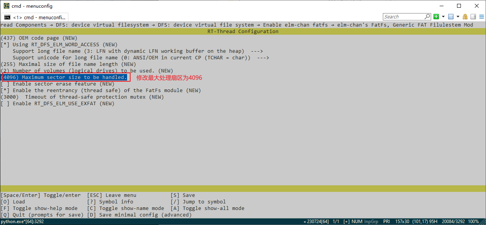

# 软件包与组件

[TOC]


# 一、软件包（Software Package）

定义：具有特定的功能，用来完成特定任务的一个程序或一组程序。可以粗略地把他理解为帮助我们完成了底层驱动的编写，我们只需要使用里面提供的API就好了。

功能：能够帮助我们更快的进行应用开发。

RT-Thread 软件包中心：[软件包](https://packages.rt-thread.org/index.html)

ENV Kconfig配置文件


## 1.1 温湿度传感器——AHT10（I2C设备）

### 1.1.1 前语

我们先想想，如果我们想要驱动一个I2C设备，需要做一些什么

1. 找到传感器命令
2. 找到I2C设备
3. 利用API编写驱动，包括写命令`write_reg()`、读命令`read()`、获取参数命令…

不使用软件包：[代码文件](.\Docx\AHT10NotUsePackage.c)

### 1.1.2 打开板载的AHT外设驱动

1. 打开板上外设AHT32开关
2. 因为Kconfig里面关联了，所以不用再次打开软件包
3. 查看确认一下
4. 搜索rt_vsprintf_full软件包（支持浮点输出）

### 1.1.3 下载软件包

1. 使用`pkgs –update`，下载软件包

### 1.1.4 编写代码

[代码文件](./Docx/AHT10UsePackage.c)

## 1.2 MQTT协议（搭配阿里云平台）

### 1.2.1 原理

MQTT（Message Queuing Telemetry Transport）是一种轻量级、基于发布-订阅模式的消息传输协议，适用于资源受限的设备和低带宽、高延迟或不稳定的网络环境。它在物联网应用中广受欢迎，能够实现传感器、执行器和其它设备之间的高效通信。

特点：

- **轻量级：**物联网设备通常在处理能力、内存和能耗方面受到限制。MQTT 开销低、报文小的特点使其非常适合这些设备，因为它消耗更少的资源，即使在有限的能力下也能实现高效的通信。

- **可靠：**物联网网络常常面临高延迟或连接不稳定的情况。MQTT 支持多种 QoS 等级、会话感知和持久连接，即使在困难的条件下也能保证消息的可靠传递，使其非常适合物联网应用。

  三种Qos等级：最多一次（QoS0）、至少一次（QoS1）、仅一次（QoS2）

- **便于拓展：**如果有设备需要获取某个传感器的消息，只需要订阅这个主题就好了。

### 1.2.2 运行框架

**Client：**客户端，即我们使用的设备。

使用MQTT的程序或设备。客户端总是通过网络连接到服务端。它可以

- 发布应用消息给其它相关的客户端。
- 订阅以请求接受相关的应用消息。
- 取消订阅以移除接受应用消息的请求。
- 从服务端断开连接。

**Server：**服务端

作为发送消息的客户端和请求订阅的客户端之间的中介。服务端

- 接受来自客户端的网络连接。
- 接受客户端发布的应用消息。
- 处理客户端的订阅和取消订阅请求。
- 转发应用消息给符合条件的已订阅客户端。

**Topic Name：**主题名

附加在应用消息上的一个标签，服务端已知且与订阅匹配。服务端发送应用消息的一个副本给每一个匹配的客户端订阅。

**Subscription：** 订阅

订阅相应的主题名来获取对应的信息。

**Publish：**发布

在对应主题上发布新的消息。


### 1.2.3 阿里云搭建

平台：[https://www.aliyun.com/product/iot/iot_instc_public_cn](https://www.aliyun.com/product/iot/iot_instc_public_cn)

进入后进行注册（如果你是新账户的话）并登录，然后选择管理控制台


在管理控制台下选择公共实例


点击创建产品


按要求输出，产品名称可以随意填写


然后返回，点击设备，创建设备


创建完成后可以新建一个物模型变量


然后点击发布上线，然后就可以在功能定义这里看到刚刚定义的功能了。记得在Topic类列表中修改自定义user/get的权限改为订阅和发布，这样子我们才能通过这个Topic进行测试。


调试功能，在课上讲。然后就是配置menuconfig。

打开RW007


在软件包中找到阿里云的软件包


使能后需要修改里面的一些参数


在阿里云中找到这些参数并修改进去


然后再打开ENV末尾的使能样例，告诉我们如何使用。

[代码文件](./Docx/MQTT_Example.c)

### 1.2.4 拓展

使用[MQTTX](https://mqttx.app/zh/downloads)去模拟设备。

使用云产品流转，去将一个设备发送上来的消息转发到其他主题上。

### 1.2.5 参考资料

[参考资料1](https://mcxiaoke.gitbooks.io/mqtt-cn/content/mqtt/01-Introduction.html)

[参考资料2](https://www.emqx.com/zh/mqtt-guide)


# 二、组件（Component）

定义：指的是一个可以独立开发、测试、部署和维护的软件单元。

## 2.1 文件系统

在本节中，我们会基于板载的W25Q64来学习如何使用[文件系统](https://www.rt-thread.org/document/site/#/rt-thread-version/rt-thread-standard/programming-manual/filesystem/filesystem)

### 2.1.1 文件系统定义

**DFS** 是 RT-Thread 提供的虚拟文件系统组件，全称为 Device File System。

### 2.1.2 文件系统架构

在 RT-Thread DFS 中，文件系统有统一的根目录，使用 `/` 来表示。


### 2.1.3 文件系统种类

| 类型  |                             特点                             |
| ----- | :----------------------------------------------------------: |
| FatFS | FatFS 是专为小型嵌入式设备开发的一个兼容微软 FAT 格式的文件系统，采用ANSI C编写，具有良好的硬件无关性以及可移植性，是 RT-Thread 中最常用的文件系统类型。我们今天使用到的elm_fat就是这个类型。 |
| RomFS | 传统型的 RomFS 文件系统是一种简单的、紧凑的、只读的文件系统，不支持动态擦写保存，按顺序存放数据，因而支持应用程序以 XIP(execute In Place，片内运行) 方式运行，在系统运行时, 节省 RAM 空间。我们一般拿其作为挂载根目录的文件系统 |
| DevFS | 即设备文件系统，在 RT-Thread 操作系统中开启该功能后，可以将系统中的设备在 `/dev` 文件夹下虚拟成文件，使得设备可以按照文件的操作方式使用 read、write 等接口进行操作。 |
| UFFS  | UFFS 是 Ultra-low-cost Flash File System（超低功耗的闪存文件系统）的简称。它是国人开发的、专为嵌入式设备等小内存环境中使用 Nand Flash 的开源文件系统。与嵌入式中常使用的 Yaffs 文件系统相比具有资源占用少、启动速度快、免费等优势。 |
| NFS   | NFS 网络文件系统（Network File System）是一项在不同机器、不同操作系统之间通过网络共享文件的技术。在操作系统的开发调试阶段，可以利用该技术在主机上建立基于 NFS 的根文件系统，挂载到嵌入式设备上，可以很方便地修改根文件系统的内容。 |

### 2.1.4 POSIX接口层

POSIX 表示可移植操作系统接口（Portable Operating System Interface of UNIX，缩写 POSIX），POSIX 标准定义了操作系统应该为应用程序提供的接口标准，是 IEEE 为要在各种 UNIX 操作系统上运行的软件而定义的一系列 API 标准的总称。

> 文件描述符：`file descriptor`（fd），每一个文件描述符会与一个打开文件相对应，同时，不同的文件描述符也可能指向同一个文件。可以简单理解为它可以帮助我们找到我们需要的文件。
> 

在文件系统中它提供了四个重要的接口：


还有一些其他常用的API：

| API                                             | 描述         |
| ----------------------------------------------- | ------------ |
| int `rename`(const char *old, const char *new); | 文件重命名   |
| int `stat`(const char *file, struct stat *buf); | 获取文件状态 |
| int `unlink`(const char *pathname);             | 删除文件     |

### 2.1.5 目录管理

除了文件的管理之外我们还需要对目录进行管理，管理使用的API：


### 2.1.6 文件系统启动流程

#### 2.1.6.1 DFS组件初始化

在这个环节中我们会初始化文件系统注册表、有关文件描述符的各种类型的锁。如果使用了设备文件系统的化还会对其做一定的初始化。

#### 2.1.6.2 各文件系统注册到DFS中

各自文件系统调用自己的一个init函数注册到DFS中。就是将上面所将的FatFS，RomFS...注册到DFS中等待使用。

#### 2.1.6.3 挂载根目录

使用RomFS创建一个简单的`”/“`根目录，使用到的其他文件系统需要挂载到这个根目录下做拓展。


## 2.2 FAL（搭配SFUD驱动使用）

### 2.2.1 SFUD

**[SFUD](https://github.com/armink/SFUD)**：(Serial Flash Universal Driver) 串行 Flash 通用驱动库。由于现有市面的串行 Flash 种类居多，各个 Flash 的规格及命令存在差异， SFUD 就是为了解决这些 Flash 的差异现状而设计。其实就是帮我们把底层的驱动代码写好，将设备抽象成SPI_FLASH，并提供给我们类似：`sfud_get_device（）`、`sfud_read（）`、`sfud_erase（）`、`sfud_write（）`...等函数接口帮助我们能够实现对不同Flash的读写。


### 2.2.2 FAL

**Fal组件**：(Flash Abstraction Layer) Flash 抽象层，是对 Flash 及基于 Flash 的分区进行管理、操作的抽象层，对上层统一了 Flash 及 分区操作的 API。并具有以下特性：

- 支持静态可配置的分区表，并可关联多个 Flash 设备；
- 分区表支持 **自动装载** 。避免在多固件项目，分区表被多次定义的问题；
- 代码精简，对操作系统 **无依赖** ，可运行于裸机平台，比如对资源有一定要求的 Bootloader；
- 统一的操作接口。保证了文件系统、OTA、NVM（例如：[EasyFlash](https://github.com/armink-rtt-pkgs/EasyFlash)） 等对 Flash 有一定依赖的组件，底层 Flash 驱动的可重用性；
- 自带基于 Finsh/MSH 的测试命令，可以通过 Shell 按字节寻址的方式操作（读写擦） Flash 或分区，方便开发者进行调试、测试；


### 2.2.3 FAL API


### 2.2.4 FAL初始化流程


## 2.3 文件系统结合FAL配置W25Q64

### 2.3.1 样例

W25Q64

首先会在`rt_hw_spi_flash()`（在INIT_COMPONENT_EXPORT）中会把一个`spi20`的spi设备挂载在`spi2`总线上，然后通过`rt_sfud_flash_probe`将这个`spi20`设备跟一个`SPI_FLASH`设备（命名为`W25Q64`）进行绑定。然后在FAL中对这个`SPI_FLASH（W25Q64）`设备进行分区，然后对相应的区创建`BLK设备`。

接着我们对这个`BLK设备`进行格式化（即挑选一种文件系统去管理这个BLK设备），然后将这个格式化好的文件系统进行挂载（分配到对应路径上）这样我们就可以使用组件的`API`对`W25Q64`进行读写了。这里使用了POSIX协议接口，我们只需要使用`open()`、`close()`、`read()`、`write()`就可以完成对文件的读写。也可以用`mkdir()`、`opendir()`、`readdir()`、`closedir()`来对目录进行管理。


1. 开启板上外设

   

2. 配置自动挂载

   

3. 配置Component组件

   

4. 配置DFS

   

5. 配置elmFat

   

```c
//记得在menuconfig中开启支持旧版本功能（Support legacy version）
#include <board.h>
#include <rtthread.h>
#include <drv_gpio.h>
#include <dfs_posix.h>//需要添加软件包进这里

//定义要写入的内容
char String[] = "Hello, RT-Thread.Welcom to RSOC!";

//定义接受文件内容的缓冲区
char buffer[100] = {};

void FileSystem_Test(void *parameter)
{
    //文件描述符
    int fd;

    //用只写方式打开文件,如果没有该文件,则创建一个文件
    fd = open("/fal/FileTest.txt", O_WRONLY | O_CREAT);

    //如果打开成功
    if (fd >= 0)
    {
        //写入文件
        write(fd, String, sizeof(String));

        rt_kprintf("Write done.\n");

        //关闭文件
        close(fd);
    }
    else
    {
        rt_kprintf("File Open Fail.\n");
    }

    //用只读方式打开文件
    fd = open("/fal/FileTest.txt", O_RDONLY);

    if (fd>= 0)
    {
        //读取文件内容
        rt_uint32_t size = read(fd, buffer, sizeof(buffer));
    
        if (size < 0)
        {
            rt_kprintf("Read File Fail.\n");
            return ;
        }

        //输出文件内容
        rt_kprintf("Read from file test.txt : %s \n", buffer);

        //关闭文件
        close(fd);
    }
    else
    {
        rt_kprintf("File Open Fail.\n");
    }
}
//导出命令
MSH_CMD_EXPORT(FileSystem_Test, FileSystem_Test);

static void readdir_sample(void)
{
    DIR *dirp;
    struct dirent *d;

    /* 打开 / dir_test 目录 */
    dirp = opendir("/fal");
    if (dirp == RT_NULL)
    {
        rt_kprintf("open directory error!\n");
    }
    else
    {
        /* 读取目录 */
        while ((d = readdir(dirp)) != RT_NULL)
        {
            rt_kprintf("found %s\n", d->d_name);
        }

        /* 关闭目录 */
        closedir(dirp);
    }
}
/* 导出到 msh 命令列表中 */
MSH_CMD_EXPORT(readdir_sample, readdir sample);

/*
#define WIFI_CS GET_PIN(F, 10)
void WIFI_CS_PULL_DOWM(void)
{
    rt_pin_mode(WIFI_CS, PIN_MODE_OUTPUT);
    rt_pin_write(WIFI_CS, PIN_LOW);
}
INIT_BOARD_EXPORT(WIFI_CS GET_PIN);
*/
```


   

