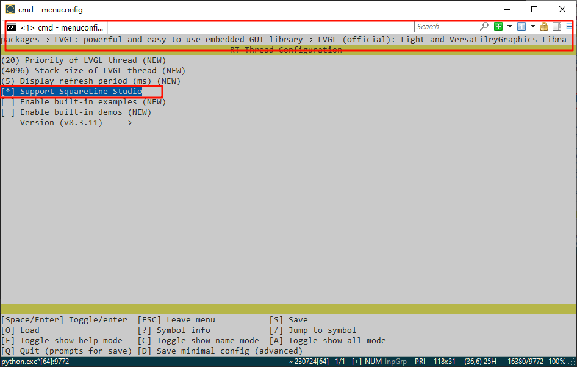

# 星火一号SquareLine Studio 使用教程
## 1. 准备一份BSP目录下星火一号的工程
## 2.Menuconfig配置
  
   
   
### 2.1更新工程
  
### 2.2修改一下依赖项的问题

### 2.3 适配LVGL按键输入
  
```c
#include <lvgl.h>
#include <stdbool.h>
#include <rtdevice.h>
#include <board.h>
#include "drv_gpio.h"

#define PIN_KEY_LEFT        GET_PIN(C, 0)   // PC0:  KEY0         --> KEY
#define PIN_KEY_DOWN        GET_PIN(C, 1)   // PC1 :  KEY1         --> KEY
#define PIN_KEY_RIGHT       GET_PIN(C, 4)   // PC4 :  KEY2         --> KEY
#define PIN_KEY_UP          GET_PIN(C, 5)   // PC5:  WK_UP        --> KEY

static uint8_t button_read(void)
{
    if (rt_pin_read(PIN_KEY_LEFT) == PIN_LOW)
    {
        return 1;
    }
    if (rt_pin_read(PIN_KEY_RIGHT) == PIN_LOW)
    {
        return 2;
    }
    if (rt_pin_read(PIN_KEY_UP) == PIN_LOW)
    {
        return 3;
    }
    if (rt_pin_read(PIN_KEY_DOWN) == PIN_LOW)
    {
        return 4;
    }
    return 0;
}

static void keypad_read(lv_indev_drv_t * indev_drv, lv_indev_data_t * data)
{
    static uint32_t last_key = 0;
    uint32_t act_key = button_read();
    if (act_key != 0)
    {
        data->state = LV_INDEV_STATE_PR;
        switch (act_key)
        {
        case 1:
            act_key = LV_KEY_PREV;
            break;
        case 2:
            act_key = LV_KEY_NEXT;
            break;
        case 3:
            act_key = LV_KEY_ESC;
            break;
        case 4:
            act_key = LV_KEY_ENTER;
        default:
            break;
        }
        last_key = act_key;
    }
    else
    {
        data->state = LV_INDEV_STATE_REL;
    }
    data->key = last_key;
}

static void Btns_Init(void)
{
    rt_pin_mode(PIN_KEY_LEFT, PIN_MODE_INPUT_PULLUP);
    rt_pin_mode(PIN_KEY_RIGHT, PIN_MODE_INPUT_PULLUP);
    rt_pin_mode(PIN_KEY_DOWN, PIN_MODE_INPUT_PULLUP);
    rt_pin_mode(PIN_KEY_UP, PIN_MODE_INPUT_PULLUP);
}

void lv_port_indev_init(void)
{
    static lv_indev_drv_t keypad_drv;
    lv_indev_t *indev_keypad;

    Btns_Init();
    lv_indev_drv_init(&keypad_drv);
    keypad_drv.type = LV_INDEV_TYPE_KEYPAD;
    keypad_drv.read_cb = keypad_read;
    indev_keypad = lv_indev_drv_register(&keypad_drv);

    lv_group_t * group = lv_group_create();
    lv_group_set_default(group);
    lv_indev_set_group(indev_keypad, group);
}
```
### 2.4打开SquareLine Studio 1.4.0


  
### 2.5 增加按键和矢量图测试
  
  

### 2.6编译烧录

## 3.项目结果  
